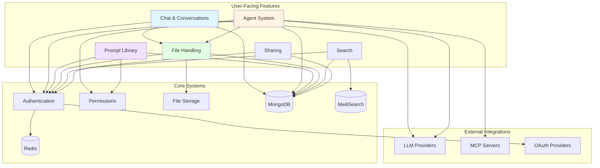

# LibreChat Complete Feature Map
 
> **Purpose:** Exhaustive inventory of every feature in LibreChat, categorized and mapped to implementation
> **Audience:** Experienced backend developers learning the codebase
> **Last Updated:** 2025-11-18
 
---
 
## Table of Contents
 
1. [Feature Overview](#feature-overview)
2. [Chat & Conversation Features](#1-chat--conversation-features)
3. [Authentication & User Management](#2-authentication--user-management)
4. [Model Provider Integrations](#3-model-provider-integrations)
5. [File & Document Handling](#4-file--document-handling)
6. [Agent System](#5-agent-system)
7. [MCP (Model Context Protocol)](#6-mcp-model-context-protocol)
8. [Prompt Library System](#7-prompt-library-system)
9. [Assistants API Integration](#8-assistants-api-integration)
10. [Search Features](#9-search-features)
11. [Sharing & Collaboration](#10-sharing--collaboration)
12. [Token Balance Management](#11-token-balance-management)
13. [Tags & Organization](#12-tags--organization)
14. [Memories System](#13-memories-system)
15. [Admin & Configuration](#14-admin--configuration)
16. [Feature Relationship Map](#feature-relationship-map)
17. [Feature Priority Matrix](#feature-priority-matrix)
18. [Implementation Complexity Map](#implementation-complexity-map)
 
---
 
## Feature Overview
 
LibreChat is a comprehensive AI chat platform with **14 major feature categories** and **100+ distinct features**. This document provides a complete inventory with implementation references.
 
### Quick Stats
 
- **Total API Routes:** 27 route modules
- **Major Features:** 14 categories
- **Authentication Strategies:** 11+ (Local, LDAP, OAuth2, SAML)
- **AI Providers Supported:** 10+ (OpenAI, Anthropic, Google, Ollama, Azure, AWS Bedrock, etc.)
- **Database Collections:** 30+ Mongoose schemas
- **Real-time Capabilities:** SSE streaming, WebSocket-like features
- **File Storage Strategies:** 4 (Local, S3, Firebase, Azure Blob)
 
---
 
## 1. Chat & Conversation Features
 
### Feature Table
 
| Feature | User-Facing Capability | API Endpoint | Implementation Entry Point | Status |
|---------|------------------------|--------------|---------------------------|--------|
| **Multi-model chat** | User can chat with different LLM providers in one interface | `POST /api/ask/{provider}` | `api/server/routes/ask/` | ✅ Core |
| **Message retrieval** | User can view conversation history with pagination | `GET /api/messages?conversationId={id}` | `api/server/routes/messages.js:23` | ✅ Core |
| **Message search** | User can search across all messages using full-text search | `GET /api/messages?search={query}` | `api/server/routes/messages.js:61` | ✅ Core |
| **Message editing** | User can edit sent messages inline | `PUT /api/messages/:conversationId/:messageId` | `api/server/routes/messages.js:241` | ✅ Core |
| **Message feedback** | User can provide thumbs up/down feedback on AI responses | `PUT /api/messages/:conversationId/:messageId/feedback` | `api/server/routes/messages.js:294` | ✅ Core |
| **Message deletion** | User can delete individual messages | `DELETE /api/messages/:conversationId/:messageId` | `api/server/routes/messages.js:319` | ✅ Core |
| **Artifact editing** | User can edit code artifacts within AI responses | `POST /api/messages/artifact/:messageId` | `api/server/routes/messages.js:119` | ✅ Core |
| **Conversation listing** | User can view all conversations with pagination & filtering | `GET /api/convos?limit=25&cursor={id}` | `api/server/routes/convos.js:29` | ✅ Core |
| **Conversation search** | User can search conversations by title/content | `GET /api/convos?search={query}` | `api/server/routes/convos.js:33` | ✅ Core |
| **Conversation archiving** | User can archive old conversations | `GET /api/convos?isArchived=true` | `api/server/routes/convos.js:32` | ✅ Core |
| **Tag filtering** | User can filter conversations by tags | `GET /api/convos?tags[]={tag}` | `api/server/routes/convos.js:37` | ✅ Core |
| **Conversation retrieval** | User can load a specific conversation | `GET /api/convos/:conversationId` | `api/server/routes/convos.js:57` | ✅ Core |
| **Auto title generation** | System generates conversation titles automatically | `POST /api/convos/gen_title` | `api/server/routes/convos.js:68` | ✅ Core |
| **Conversation deletion** | User can delete individual conversations | `DELETE /api/convos` | `api/server/routes/convos.js:95` | ✅ Core |
| **Bulk deletion** | User can delete all conversations at once | `DELETE /api/convos/all` | `api/server/routes/convos.js:139` | ✅ Core |
| **Conversation update** | User can update conversation metadata (title, tags) | `POST /api/convos/update` | `api/server/routes/convos.js:151` | ✅ Core |
| **Conversation import** | User can import conversations from JSON file | `POST /api/convos/import` | `api/server/routes/convos.js:179` | ✅ Core |
| **Conversation forking** | User can fork a conversation from any message point | `POST /api/convos/fork` | `api/server/routes/convos.js:205` | ✅ Core |
| **Conversation duplication** | User can duplicate entire conversations | `POST /api/convos/duplicate` | `api/server/routes/convos.js:226` | ✅ Core |
| **Presets** | User can save and reuse conversation configurations | `GET/POST /api/presets` | `api/server/routes/presets.js` | ✅ Core |
| **Model selection** | User can switch between different AI models | Frontend + endpoint config | `api/server/routes/endpoints.js` | ✅ Core |
 
### Deep-Dive: Message Retrieval with Search
 
**What it does:** Allows users to search across all their messages using MeiliSearch for fast full-text search with typo tolerance.
 
**How it works:**
1. **Frontend**: User types search query in search bar
2. **API Call**: `GET /api/messages?search={query}`
3. **Route Handler**: `api/server/routes/messages.js:61`
   - Calls `Message.meiliSearch(search, { filter: "user = ..." }, true)`
   - Retrieves message IDs from MeiliSearch
4. **Permission Check**: Validates user has access to conversations
5. **Database Query**: Fetches full message details from MongoDB
6. **Response**: Returns messages with conversation metadata
 
**Integration points:**
- **MeiliSearch**: Full-text search engine (`api/db/indexSync.js`)
- **MongoDB**: Message storage (`Message` model)
- **Conversation model**: For filtering and metadata
 
**Source trail:**
```
1. User action → client/src/components/Search/* (Frontend)
2. API call → GET /api/messages?search=...
3. Route → api/server/routes/messages.js:61
4. MeiliSearch → Message.meiliSearch() in @librechat/data-schemas
5. Database → getMessages() in api/models/Message.js
6. Response → Enriched messages with conversation data
```
 
### Deep-Dive: Conversation Forking
 
**What it does:** Creates a new conversation branch from any message in an existing conversation, enabling "what-if" scenarios.
 
**How it works:**
1. User selects a message to fork from
2. API: `POST /api/convos/fork` with `{ conversationId, messageId, splitAtTarget, latestMessageId }`
3. Service: `api/server/utils/import/fork.js:forkConversation()`
   - Copies all messages up to target message
   - Creates new conversation with new ID
   - Updates message references
   - Handles both "split at target" and "include target" options
4. Returns new conversation ID and copied messages
 
**Configuration:**
- `splitAtTarget`: If true, excludes the target message
- `latestMessageId`: Ensures fork uses latest data
 
**Source trail:**
📍 Source: `api/server/routes/convos.js:205-224`
📍 Service: `api/server/utils/import/fork.js`
📍 Models: `api/models/Conversation.js`, `api/models/Message.js`
 
---
 
## 2. Authentication & User Management
 
### Feature Table
 
| Feature | User-Facing Capability | API Endpoint | Implementation Entry Point | Status |
|---------|------------------------|--------------|---------------------------|--------|
| **Local registration** | User can create account with email/password | `POST /api/auth/register` | `api/server/routes/auth.js:45` | ✅ Core |
| **Local login** | User can log in with email/password | `POST /api/auth/login` | `api/server/routes/auth.js:35` | ✅ Core |
| **LDAP login** | User can authenticate via LDAP server | `POST /api/auth/login` (with LDAP middleware) | `api/server/routes/auth.js:31` | ✅ Core |
| **OAuth2 login** | User can log in via Google, GitHub, Discord, Facebook, Apple | `GET /oauth/{provider}` | `api/server/routes/oauth.js` | ✅ Core |
| **JWT authentication** | System validates user sessions with JWT tokens | Middleware on protected routes | `api/server/middleware/requireJwtAuth.js` | ✅ Core |
| **Token refresh** | System refreshes expired access tokens | `POST /api/auth/refresh` | `api/server/routes/auth.js:43` | ✅ Core |
| **Logout** | User can end their session | `POST /api/auth/logout` | `api/server/routes/auth.js:33` | ✅ Core |
| **2FA enable** | User can enable two-factor authentication | `GET /api/auth/2fa/enable` | `api/server/routes/auth.js:66` | ✅ Core |
| **2FA verify** | User verifies 2FA setup with TOTP code | `POST /api/auth/2fa/verify` | `api/server/routes/auth.js:67` | ✅ Core |
| **2FA confirm** | User confirms 2FA enrollment | `POST /api/auth/2fa/confirm` | `api/server/routes/auth.js:69` | ✅ Core |
| **2FA disable** | User can disable 2FA | `POST /api/auth/2fa/disable` | `api/server/routes/auth.js:70` | ✅ Core |
| **2FA backup codes** | User can regenerate backup codes | `POST /api/auth/2fa/backup/regenerate` | `api/server/routes/auth.js:71` | ✅ Core |
| **Password reset request** | User can request password reset email | `POST /api/auth/requestPasswordReset` | `api/server/routes/auth.js:53` | ✅ Core |
| **Password reset** | User can reset password with token | `POST /api/auth/resetPassword` | `api/server/routes/auth.js:60` | ✅ Core |
| **Email verification** | User verifies email address | `POST /api/user/verify` | `api/server/routes/user.js:20` | ✅ Core |
| **Resend verification** | User can resend verification email | `POST /api/user/verify/resend` | `api/server/routes/user.js:21` | ✅ Core |
| **User profile** | User can view their profile information | `GET /api/user` | `api/server/routes/user.js:15` | ✅ Core |
| **Account deletion** | User can delete their account | `DELETE /api/user/delete` | `api/server/routes/user.js:19` | ✅ Core |
| **Terms acceptance** | User can view and accept terms of service | `GET/POST /api/user/terms` | `api/server/routes/user.js:16-17` | ✅ Core |
| **Plugin auth** | User can configure authentication for plugins | `POST /api/user/plugins` | `api/server/routes/user.js:18` | ✅ Core |
| **Graph token** | User can get Microsoft Graph access token | `GET /api/auth/graph-token` | `api/server/routes/auth.js:73` | ✅ Core |
 
### Authentication Architecture
 
**Supported Strategies (11+):**
📍 Source: `api/package.json:1-126` - Passport strategies
 
1. **Local** - Email/password with bcrypt hashing
2. **LDAP** - LDAP server authentication
3. **Google OAuth2** - passport-google-oauth20
4. **GitHub OAuth2** - passport-github2
5. **Discord OAuth2** - passport-discord
6. **Facebook OAuth2** - passport-facebook
7. **Apple OAuth2** - passport-apple
8. **OpenID Connect** - passport-openidconnect
9. **Azure AD** - passport-azure-ad
10. **SAML** - passport-saml (commented but available)
11. **JWT** - passport-jwt for API authentication
 
### Deep-Dive: Authentication Flow
 
**Local Login Flow:**
```
1. Frontend: Login form submission
   📍 client/src/components/Auth/Login.tsx
 
2. API Request: POST /api/auth/login
   Body: { email, password }
 
3. Route Handler: api/server/routes/auth.js:35
   - Applies middleware chain:
     * logHeaders
     * loginLimiter (rate limiting)
     * checkBan (ban check)
     * requireLdapAuth OR requireLocalAuth
 
4. Middleware: requireLocalAuth
   📍 api/server/middleware/requireLocalAuth.js
   - Uses Passport LocalStrategy
   - Strategy: api/strategies/localStrategy.js
   - Validates credentials against database
   - Hashes password with bcrypt
 
5. Controller: loginController
   📍 api/server/controllers/auth/LoginController.js
   - Generates JWT access token (15min expiry)
   - Generates refresh token (7 days expiry)
   - Sets HTTP-only cookies
   - Returns user data + tokens
 
6. Frontend: Stores tokens, redirects to chat
```
 
**2FA Flow (if enabled):**
```
1. After successful password validation
2. System checks if user has 2FA enabled
3. Instead of full JWT, issues temporary token
4. Redirects to 2FA verification page
5. User enters TOTP code from authenticator app
6. POST /api/auth/2fa/verify-temp
7. System validates TOTP code
8. Issues full JWT tokens
9. Completes login
```
 
---
 
## 3. Model Provider Integrations
 
### Feature Table
 
| Provider | Supported Models | Integration Type | Config Location | Implementation | Status |
|----------|------------------|------------------|-----------------|----------------|--------|
| **OpenAI** | GPT-4, GPT-4 Turbo, GPT-3.5 Turbo, o1 series | Official SDK | `.env: OPENAI_API_KEY` | `api/app/clients/OpenAIClient.js` | ✅ Core |
| **Anthropic** | Claude 3.5 Sonnet, Claude 3 Opus/Sonnet/Haiku | Official SDK | `.env: ANTHROPIC_API_KEY` | `api/app/clients/AnthropicClient.js` | ✅ Core |
| **Google** | Gemini Pro, Gemini 1.5 Pro/Flash | Official SDK | `.env: GOOGLE_API_KEY` | `api/app/clients/GoogleClient.js` | ✅ Core |
| **Ollama** | All Ollama models (local/remote) | REST API | `.env: OLLAMA_BASE_URL` | `api/app/clients/OllamaClient.js` | ✅ Core |
| **Azure OpenAI** | Azure-hosted OpenAI models | Azure SDK | `.env: AZURE_OPENAI_*` | `api/app/clients/AzureOpenAIClient.js` | ✅ Core |
| **AWS Bedrock** | Claude, Llama, Titan models | AWS SDK | `.env: AWS_*` | `api/server/services/Endpoints/bedrock/` | ✅ Core |
| **OpenRouter** | 100+ models via unified API | REST API | `.env: OPENROUTER_API_KEY` | Endpoint configuration | ✅ Core |
| **Groq** | Llama, Mixtral models | REST API | `.env: GROQ_API_KEY` | Endpoint configuration | ✅ Core |
| **Mistral AI** | Mistral, Mixtral models | Official SDK | `.env: MISTRAL_API_KEY` | Endpoint configuration | ✅ Core |
| **Custom Endpoints** | Any OpenAI-compatible API | REST API | `librechat.yaml` | Custom endpoint config | ✅ Core |
 
### Provider Abstraction Pattern
 
**Base Client Architecture:**
📍 Source: `api/app/clients/BaseClient.js`
 
All provider clients extend `BaseClient` which provides:
- Common interface for chat completion
- Message formatting standardization
- Token counting
- Error handling
- Streaming support
 
**Example: Adding a New Provider**
 
```javascript
// 1. Create adapter: api/app/clients/NewProviderClient.js
const BaseClient = require('./BaseClient');
 
class NewProviderClient extends BaseClient {
  constructor(apiKey, options = {}) {
    super(apiKey, options);
    this.sender = 'NewProvider';
  }
 
  async sendMessage(payload, opts = {}) {
    // Transform LibreChat format → Provider format
    const providerPayload = this.buildPayload(payload);
 
    // Call provider API
    const response = await this.provider.chat(providerPayload);
 
    // Transform Provider format → LibreChat format
    return this.handleResponse(response);
  }
 
  buildPayload(options) {
    // Provider-specific formatting
  }
}
 
module.exports = NewProviderClient;
 
// 2. Register in api/app/clients/index.js
// 3. Add to endpoint configuration
// 4. Update frontend dropdown
```
 
### Deep-Dive: Streaming Architecture
 
**How real-time streaming works:**
 
LibreChat uses **Server-Sent Events (SSE)** for streaming AI responses:
 
```
1. Frontend initiates SSE connection:
   📍 client/src/data-provider/mutations.ts
   - Opens EventSource to streaming endpoint
   - Listens for 'message', 'error', 'done' events
 
2. Backend establishes provider connection:
   📍 api/app/clients/OpenAIClient.js (example)
   - Calls provider API with { stream: true }
   - Receives chunks via async iterator
 
3. Chunk Processing:
   for await (const chunk of stream) {
     - Parse chunk
     - Extract text delta
     - Send via SSE: res.write(`data: ${JSON.stringify(chunk)}\n\n`)
   }
 
4. Frontend updates UI:
   - Receives each chunk
   - Appends to message text
   - Re-renders component with new text
 
5. Completion:
   - Backend sends 'done' event
   - Closes SSE connection
   - Saves complete message to database
```
 
**Why SSE over WebSocket?**
- Simpler implementation
- Automatic reconnection
- HTTP/2 multiplexing support
- Better compatibility with proxies/CDNs
 
---
 
## 4. File & Document Handling
 
### Feature Table
 
| Feature | User-Facing Capability | API Endpoint | Implementation Entry Point | Status |
|---------|------------------------|--------------|---------------------------|--------|
| **File upload** | User can upload files for analysis | `POST /api/files` | `api/server/routes/files/index.js:33` | ✅ Core |
| **Image upload** | User can upload images | `POST /api/files/images` | `api/server/routes/files/index.js:34` | ✅ Core |
| **Avatar upload** | User can upload profile avatar | `POST /api/files/images/avatar` | `api/server/routes/files/index.js:35` | ✅ Core |
| **Agent avatar** | User can set custom agent avatars | `POST /api/files/images/agents/:agent_id/avatar` | `api/server/routes/files/index.js:36` | ✅ Core |
| **Assistant avatar** | User can set custom assistant avatars | `POST /api/files/images/assistants/:assistant_id/avatar` | `api/server/routes/files/index.js:37` | ✅ Core |
| **File retrieval** | User can access uploaded files | `GET /api/files/:fileId` | `api/server/routes/files/files.js` | ✅ Core |
| **Image serving** | System serves images with optional security | `GET /images/:filename` | `api/server/routes/static.js` | ✅ Core |
| **Speech-to-text** | User can convert audio to text | `POST /api/files/speech/stt` | `api/server/routes/files/speech.js` | ✅ Core |
| **Text-to-speech** | User can convert text to audio | `POST /api/files/speech/tts` | `api/server/routes/files/speech.js` | ✅ Core |
| **File deletion** | User can delete uploaded files | `DELETE /api/files/:fileId` | `api/server/routes/files/files.js` | ✅ Core |
 
### File Storage Strategies
 
**Granular per-type configuration:**
📍 Source: `librechat.yaml` - fileStrategy section
 
```yaml
fileStrategy:
  avatar: "local"       # User/agent avatars
  image: "s3"          # Chat images
  document: "firebase"  # Document uploads
  audio: "azure"       # Audio files
```
 
**Strategy Implementations:**
 
1. **Local Filesystem**
   📍 `api/server/services/Files/Local/`
   - Stores in `api/uploads/` directory
   - Good for: Development, single-server deployments
   - Pros: Simple, no external dependencies
   - Cons: Not scalable, no CDN
 
2. **AWS S3**
   📍 `api/server/services/Files/S3/`
   - Uses AWS SDK (@aws-sdk/client-s3)
   - Supports: S3, S3-compatible APIs (MinIO, DigitalOcean Spaces)
   - Features: Presigned URLs, CDN integration
   - Good for: Production, multi-server deployments
 
3. **Firebase Storage**
   📍 `api/server/services/Files/Firebase/`
   - Uses Firebase Admin SDK
   - Features: Built-in CDN, Google Cloud integration
   - Good for: Firebase ecosystem users
 
4. **Azure Blob Storage**
   📍 `api/server/services/Files/Azure/`
   - Uses @azure/storage-blob
   - Features: Azure CDN integration
   - Good for: Azure ecosystem users
 
### Deep-Dive: File Upload Flow
 
**Complete upload flow with image processing:**
 
```
1. Frontend: User selects file
   📍 client/src/components/Files/FileUpload.tsx
   - Validates file type and size
   - Shows preview if image
   - Calls upload API
 
2. API Request: POST /api/files/images
   - Content-Type: multipart/form-data
   - Middleware chain applies:
     * requireJwtAuth: Authenticate user
     * configMiddleware: Load file config
     * checkBan: Verify user not banned
     * fileUploadIpLimiter: Rate limit by IP
     * fileUploadUserLimiter: Rate limit by user
     * upload.single('file'): Multer processes upload
 
3. Multer Processing:
   📍 api/server/routes/files/multer.js
   - Receives file stream
   - Validates MIME type
   - Stores in memory buffer
   - Attaches to req.file
 
4. Image Processing:
   📍 api/server/routes/files/images.js
   - Uses Sharp library for image optimization
   - Resizes if needed (max dimensions)
   - Converts to WebP for efficiency
   - Generates thumbnail
 
5. Storage Selection:
   📍 api/server/services/Files/initialize.js
   - Reads fileStrategy config
   - Selects appropriate strategy (S3/local/etc)
   - Calls strategy.uploadFile()
 
6. Storage Strategy:
   Example: S3 strategy
   - Generates unique key
   - Uploads to S3 bucket
   - Sets appropriate ACLs
   - Returns public URL or presigned URL
 
7. Database Record:
   📍 api/models/File.js
   - Creates File document with:
     * file_id (UUID)
     * user (owner)
     * filepath (storage URL)
     * filename, type, bytes
     * embedded: false (for future RAG)
   - Saves to MongoDB
 
8. Response:
   Returns: {
     file_id: "uuid",
     filepath: "https://s3.../file.webp",
     filename: "original.jpg",
     type: "image/webp",
     bytes: 45000
   }
 
9. Frontend: Displays uploaded image
   - Shows in chat input area
   - Includes in next message
```
 
---
 
## 5. Agent System
 
### Feature Table
 
| Feature | User-Facing Capability | API Endpoint | Implementation Entry Point | Status |
|---------|------------------------|--------------|---------------------------|--------|
| **Agent creation** | User can create custom AI agents with tools | `POST /api/agents` | `api/server/routes/agents/v1.js:58` | ✅ Core |
| **Agent listing** | User can browse available agents | `GET /api/agents` | `api/server/routes/agents/v1.js:157` | ✅ Core |
| **Agent retrieval** | User can view agent details | `GET /api/agents/:id` | `api/server/routes/agents/v1.js:67` | ✅ Core |
| **Agent expanded view** | User can view full agent config (if owner) | `GET /api/agents/:id/expanded` | `api/server/routes/agents/v1.js:84` | ✅ Core |
| **Agent update** | User can modify agent configuration | `PATCH /api/agents/:id` | `api/server/routes/agents/v1.js:100` | ✅ Core |
| **Agent duplication** | User can duplicate existing agents | `POST /api/agents/:id/duplicate` | `api/server/routes/agents/v1.js:116` | ✅ Core |
| **Agent deletion** | User can delete their agents | `DELETE /api/agents/:id` | `api/server/routes/agents/v1.js:132` | ✅ Core |
| **Agent versioning** | System tracks agent configuration versions | Automatic on update | `api/models/Agent.js` | ✅ Core |
| **Agent reversion** | User can revert to previous agent version | `POST /api/agents/:id/revert` | `api/server/routes/agents/v1.js:149` | ✅ Core |
| **Agent avatar** | User can set custom agent avatar | `POST /api/files/images/agents/:agent_id/avatar` | `api/server/routes/agents/v1.js:167` | ✅ Core |
| **Agent categories** | User can browse agents by category | `GET /api/agents/categories` | `api/server/routes/agents/v1.js:51` | ✅ Core |
| **Agent chat** | User can chat with agents | `POST /api/agents/v1/chat` | `api/server/routes/agents/chat.js` | ✅ Core |
| **Agent tools** | User can see available tools for agents | `GET /api/agents/tools` | `api/server/routes/agents/tools.js` | ✅ Core |
| **Agent actions** | User can configure custom actions for agents | `GET/POST /api/agents/actions` | `api/server/routes/agents/actions.js` | ✅ Core |
| **Agent permissions** | System controls agent access via ACL | Middleware on all agent routes | `api/server/middleware/canAccessAgentResource.js` | ✅ Core |
 
### Agent Architecture
 
**What are Agents?**
LibreChat Agents are custom AI assistants that can:
- Use tools (code execution, web search, file access, MCP tools)
- Have custom instructions and personality
- Access external APIs
- Maintain conversation memory
- Be shared with other users
 
**Agent Configuration:**
📍 Source: `api/models/Agent.js` - Schema definition
 
```typescript
Agent {
  id: string;
  name: string;
  description: string;
  instructions: string;          // System prompt
  model: string;                 // Which LLM to use
  provider: string;              // Which provider
  tools: Tool[];                 // Available tools
  actions: Action[];             // Custom actions
  avatar: {
    source: string;              // URL or filepath
    filepath: string;
  };
  author: string;                // Creator user ID
  version: number;               // Current version
  version_history: Version[];    // Previous configurations
  projectIds: string[];          // Shared with projects
  createdAt: Date;
  updatedAt: Date;
}
```
 
### Deep-Dive: Agent Chat Flow
 
**How agents process messages:**
 
```
1. User sends message to agent:
   POST /api/agents/v1/chat/completions
   Body: {
     agent_id: "agent_123",
     messages: [...],
     stream: true
   }
 
2. Route Handler: api/server/routes/agents/chat.js
   - Validates user has access to agent
   - Loads agent configuration
 
3. Agent Loading:
   📍 api/models/Agent.js:getAgent()
   - Fetches agent from database
   - Resolves tool configurations
   - Loads custom instructions
 
4. Tool Initialization:
   📍 api/server/services/ToolService.js
   - Loads enabled tools for agent
   - Initializes tool handlers:
     * Code Interpreter
     * Web Search
     * File Upload
     * MCP Tools
     * Custom Actions
 
5. Message Processing:
   📍 api/server/services/Agents/
   - Builds system prompt from agent.instructions
   - Adds tool definitions to prompt
   - Formats conversation history
   - Calls underlying LLM provider
 
6. Tool Execution (if needed):
   - Agent decides to use a tool
   - System executes tool:
     * code_interpreter → Runs in sandboxed container
     * web_search → Queries search API + reranking
     * mcp_tool → Calls MCP server
   - Tool result added to conversation
   - Agent continues reasoning
 
7. Response Streaming:
   - Chunks sent via SSE
   - Frontend updates in real-time
   - Tool calls shown in UI
 
8. Completion:
   - Final message saved to database
   - Agent run logged for analytics
   - Memory updated (if enabled)
```
 
### Agent Permission System
 
**Granular access control:**
📍 Source: `api/server/middleware/canAccessAgentResource.js`
 
```javascript
// Permission bits (bitwise operations)
PermissionBits.VIEW   = 0b0001  // Can view agent
PermissionBits.USE    = 0b0010  // Can chat with agent
PermissionBits.EDIT   = 0b0100  // Can modify agent
PermissionBits.DELETE = 0b1000  // Can delete agent
PermissionBits.SHARE  = 0b10000 // Can share agent
 
// Access check flow:
1. Middleware extracts agent_id from request
2. Queries PermissionService for user's permissions
3. Checks required permission bit
4. Allows or denies request
 
// Example: User updating agent requires EDIT permission
PATCH /api/agents/:id
→ canAccessAgentResource({ requiredPermission: PermissionBits.EDIT })
→ Checks user has EDIT bit set for this agent
→ Proceeds if true, returns 403 if false
```
 
---
 
## 6. MCP (Model Context Protocol)
 
### Feature Table
 
| Feature | User-Facing Capability | API Endpoint | Implementation Entry Point | Status |
|---------|------------------------|--------------|---------------------------|--------|
| **MCP tools listing** | User can see available MCP tools | `GET /api/mcp/tools` | `api/server/routes/mcp.js:28` | ✅ Core |
| **OAuth initiate** | User can start OAuth flow for MCP server | `GET /api/mcp/:serverName/oauth/initiate` | `api/server/routes/mcp.js:36` | ✅ Core |
| **OAuth callback** | System handles OAuth callback | `GET /api/mcp/:serverName/oauth/callback` | `api/server/routes/mcp.js:88` | ✅ Core |
| **OAuth status** | User can check OAuth flow status | `GET /api/mcp/oauth/status/:flowId` | `api/server/routes/mcp.js:286` | ✅ Core |
| **OAuth cancel** | User can cancel pending OAuth flow | `POST /api/mcp/oauth/cancel/:serverName` | `api/server/routes/mcp.js:313` | ✅ Core |
| **Server reinitialize** | User can reconnect to MCP server | `POST /api/mcp/:serverName/reinitialize` | `api/server/routes/mcp.js:355` | ✅ Core |
| **Connection status** | User can check MCP server connection status | `GET /api/mcp/connection/status` | `api/server/routes/mcp.js:418` | ✅ Core |
| **Single server status** | User can check specific server status | `GET /api/mcp/connection/status/:serverName` | `api/server/routes/mcp.js:458` | ✅ Core |
| **Auth values check** | User can see which auth values are configured | `GET /api/mcp/:serverName/auth-values` | `api/server/routes/mcp.js:507` | ✅ Core |
 
### MCP Architecture
 
**What is MCP?**
Model Context Protocol is a standardized way for LLMs to interact with external tools and data sources. LibreChat implements MCP client capabilities.
 
**MCP Features:**
- Connect to MCP servers (local or remote)
- OAuth2 authentication for MCP servers
- Tool discovery and execution
- User-scoped and app-scoped connections
- Automatic reconnection handling
 
**Configuration:**
📍 Source: `librechat.yaml` - MCP section
 
```yaml
mcp:
  servers:
    filesystem:
      command: "npx"
      args: ["-y", "@modelcontextprotocol/server-filesystem", "/path/to/files"]
      env:
        CUSTOM_VAR: "value"
 
    github:
      url: "http://mcp-server:3000"
      oauth:
        client_id: "your_client_id"
        client_secret: "your_client_secret"
        authorization_url: "https://github.com/login/oauth/authorize"
        token_url: "https://github.com/login/oauth/access_token"
        scopes: ["repo", "user"]
      customUserVars:
        - GITHUB_TOKEN
```
 
### Deep-Dive: MCP Tool Execution
 
**Flow when agent uses MCP tool:**
 
```
1. Agent decides to use MCP tool:
   Tool call: {
     type: "function",
     function: {
       name: "mcp__github__create_issue",
       arguments: { title: "Bug", body: "Description" }
     }
   }
 
2. Tool Router:
   📍 api/server/services/ToolService.js
   - Detects "mcp__" prefix
   - Extracts server name: "github"
   - Extracts tool name: "create_issue"
 
3. MCP Manager:
   📍 packages/api/src/mcp/MCPManager.ts
   - Gets or creates connection to server
   - Checks connection status
   - Handles OAuth if needed
 
4. OAuth Flow (if needed):
   - Checks if user has valid OAuth token
   - If not: Initiates OAuth flow
   - User redirected to authorization page
   - Callback stores tokens
   - Reconnects with new credentials
 
5. Tool Invocation:
   📍 packages/api/src/mcp/MCPConnection.ts
   - Sends tool call to MCP server
   - MCP server executes tool
   - Returns result
 
6. Result Processing:
   - Tool result formatted for LLM
   - Added to conversation
   - Agent continues with result
 
7. Response to User:
   - Agent incorporates tool result
   - Generates final response
   - Streams to user
```
 
### MCP Connection Management
 
**User-scoped vs App-scoped:**
 
```typescript
// App-scoped connection (shared by all users)
- Configured at system level
- Uses server-wide credentials
- Good for: Public APIs, read-only tools
 
// User-scoped connection (per-user credentials)
- User provides their own OAuth token or API key
- Isolated per user
- Good for: GitHub (personal repos), Notion (personal workspace)
 
// Example: GitHub MCP server
- App-scoped: Can read public repos
- User-scoped: Can access user's private repos, create issues, etc.
```
 
📍 Implementation: `packages/api/src/mcp/MCPManager.ts`
📍 OAuth Handler: `packages/api/src/mcp/MCPOAuthHandler.ts`
📍 Token Storage: `api/models/Token.js`
 
---
 
## 7. Prompt Library System
 
### Feature Table
 
| Feature | User-Facing Capability | API Endpoint | Implementation Entry Point | Status |
|---------|------------------------|--------------|---------------------------|--------|
| **Prompt group list** | User can view all prompt groups | `GET /api/prompts/groups` | `api/server/routes/prompts.js:156` | ✅ Core |
| **All prompts** | User can view all accessible prompts | `GET /api/prompts/all` | `api/server/routes/prompts.js:101` | ✅ Core |
| **Single prompt group** | User can view specific prompt group | `GET /api/prompts/groups/:groupId` | `api/server/routes/prompts.js:74` | ✅ Core |
| **Create prompt group** | User can create new prompt group | `POST /api/prompts` | `api/server/routes/prompts.js:319` | ✅ Core |
| **Add prompt to group** | User can add prompt to existing group | `POST /api/prompts/groups/:groupId/prompts` | `api/server/routes/prompts.js:322` | ✅ Core |
| **Update prompt group** | User can modify prompt group | `PATCH /api/prompts/groups/:groupId` | `api/server/routes/prompts.js:355` | ✅ Core |
| **Delete prompt group** | User can delete prompt group | `DELETE /api/prompts/groups/:groupId` | `api/server/routes/prompts.js:484` | ✅ Core |
| **Get single prompt** | User can view specific prompt | `GET /api/prompts/:promptId` | `api/server/routes/prompts.js:383` | ✅ Core |
| **Get prompts in group** | User can view all prompts in a group | `GET /api/prompts?groupId={id}` | `api/server/routes/prompts.js:396` | ✅ Core |
| **Delete prompt** | User can delete a prompt | `DELETE /api/prompts/:promptId` | `api/server/routes/prompts.js:475` | ✅ Core |
| **Mark as production** | User can mark prompt as production-ready | `PATCH /api/prompts/:promptId/tags/production` | `api/server/routes/prompts.js:364` | ✅ Core |
| **Prompt search** | User can search prompts by name/category | Query params | Built into listing endpoints | ✅ Core |
| **Prompt sharing** | User can share prompt groups with others | Permission system | ACL-based | ✅ Core |
 
### Prompt System Architecture
 
**What are Prompts?**
LibreChat's Prompt Library allows users to:
- Save reusable prompt templates
- Organize prompts into groups
- Version prompts
- Share prompts with team
- Mark prompts as "production"
 
**Data Model:**
📍 Source: `api/models/Prompt.js`
 
```typescript
PromptGroup {
  _id: ObjectId;
  name: string;
  description: string;
  author: string;              // Creator
  authorName: string;
  category: string;            // For organization
  projectIds: string[];        // Sharing
  createdAt: Date;
  updatedAt: Date;
}
 
Prompt {
  _id: ObjectId;
  groupId: ObjectId;           // Parent group
  name: string;
  content: string;             // The actual prompt
  variables: Variable[];       // {{variable}} placeholders
  tags: string[];              // ["production", "draft"]
  author: string;
  authorName: string;
  createdAt: Date;
  updatedAt: Date;
}
 
Variable {
  name: string;
  type: "string" | "number" | "boolean";
  description: string;
  defaultValue: any;
}
```
 
### Deep-Dive: Prompt Usage Flow
 
**How prompts are used in conversation:**
 
```
1. User selects prompt from library:
   📍 client/src/components/Prompts/PromptLibrary.tsx
   - Browses prompt groups
   - Searches by name/category
   - Selects prompt
 
2. Prompt Loading:
   GET /api/prompts/:promptId
   - Fetches prompt content
   - Includes variables
 
3. Variable Resolution:
   Frontend shows variable input form:
   - Prompt: "Write a {{style}} email about {{topic}}"
   - User fills: style="formal", topic="meeting"
 
4. Prompt Rendering:
   - Replaces {{style}} with "formal"
   - Replaces {{topic}} with "meeting"
   - Result: "Write a formal email about meeting"
 
5. Chat Submission:
   - Rendered prompt sent as user message
   - Agent/model processes as normal
   - Variables resolved, not visible in conversation
 
6. Prompt Tracking:
   - System tracks which prompts are used
   - Analytics on prompt performance
   - Helps identify best prompts
```
 
### Prompt Permission System
 
**Access Control:**
📍 Source: `api/server/middleware/canAccessPromptGroupResource.js`
 
Similar to Agent permissions:
- **VIEW**: Can see prompt group and contents
- **EDIT**: Can modify prompts in group
- **DELETE**: Can delete prompts/group
- **SHARED_GLOBAL**: Can share with entire organization
 
**Sharing Workflow:**
```
1. User creates prompt group (automatically gets OWNER role)
2. User shares with specific users or projects
3. Permission system grants appropriate access
4. Shared users see prompt in their library
5. Based on permissions, can view/edit/use prompts
```
 
---
 
## 8. Assistants API Integration
 
### Feature Table
 
| Feature | User-Facing Capability | API Endpoint | Implementation Entry Point | Status |
|---------|------------------------|--------------|---------------------------|--------|
| **List assistants** | User can view OpenAI/Azure assistants | `GET /api/assistants` | `api/server/routes/assistants/v1.js` | ✅ Core |
| **Create assistant** | User can create new assistant | `POST /api/assistants` | `api/server/routes/assistants/v1.js` | ✅ Core |
| **Get assistant** | User can view assistant details | `GET /api/assistants/:id` | `api/server/routes/assistants/v1.js` | ✅ Core |
| **Update assistant** | User can modify assistant | `PATCH /api/assistants/:id` | `api/server/routes/assistants/v1.js` | ✅ Core |
| **Delete assistant** | User can delete assistant | `DELETE /api/assistants/:id` | `api/server/routes/assistants/v1.js` | ✅ Core |
| **Assistant chat** | User can chat with assistants | `POST /api/assistants/v1/chat` | `api/server/routes/assistants/chat.js` | ✅ Core |
| **Assistant avatar** | User can set assistant avatar | `POST /api/files/images/assistants/:assistant_id/avatar` | Avatar route | ✅ Core |
 
**Note:** LibreChat Assistants are wrappers around OpenAI's Assistants API and Azure's equivalent. They provide a unified interface for both.
 
---
 
## 9. Search Features
 
### Feature Table
 
| Feature | User-Facing Capability | API Endpoint | Implementation Entry Point | Status |
|---------|------------------------|--------------|---------------------------|--------|
| **Message search** | User can search all messages | `GET /api/messages?search={query}` | `api/server/routes/messages.js:61` | ✅ Core |
| **Conversation search** | User can search conversations | `GET /api/convos?search={query}` | `api/server/routes/convos.js:33` | ✅ Core |
| **Search enabled check** | Frontend checks if search is available | `GET /api/search/enable` | `api/server/routes/search.js:10` | ✅ Core |
 
### Search Architecture
 
**Technology:** MeiliSearch (fast, typo-tolerant full-text search)
 
**How it works:**
📍 Source: `api/db/indexSync.js`
 
```javascript
// Background sync process
1. MongoDB Change Streams listen for:
   - New messages
   - Updated messages
   - Deleted messages
 
2. On change event:
   - Extract relevant fields (text, conversationId, user)
   - Format for MeiliSearch
   - Index in MeiliSearch
 
3. Search query:
   - User types search term
   - Frontend calls /api/messages?search=term
   - Backend queries MeiliSearch
   - MeiliSearch returns matching message IDs
   - Backend fetches full messages from MongoDB
   - Returns to frontend
 
4. Features:
   - Typo tolerance ("mesage" finds "message")
   - Fuzzy matching
   - Ranking by relevance
   - Faceted filtering (by user, by date, by conversation)
```
 
**Configuration:**
```env
SEARCH=true                    # Enable search
MEILI_HOST=http://localhost:7700
MEILI_MASTER_KEY=your_key
```
 
---
 
## 10. Sharing & Collaboration
 
### Feature Table
 
| Feature | User-Facing Capability | API Endpoint | Implementation Entry Point | Status |
|---------|------------------------|--------------|---------------------------|--------|
| **Share conversation** | User can create shareable link for conversation | `POST /api/share` | `api/server/routes/share.js` | ✅ Core |
| **View shared conversation** | Anyone with link can view conversation | `GET /share/:shareId` | Frontend route | ✅ Core |
| **Revoke share** | User can disable share link | `DELETE /api/share/:shareId` | `api/server/routes/share.js` | ✅ Core |
| **List shares** | User can view all their shared conversations | `GET /api/share` | `api/server/routes/share.js` | ✅ Core |
 
**Implementation:**
📍 Source: `api/models/Share.js`
 
```typescript
Share {
  shareId: string;              // Public ID (UUID)
  conversationId: string;       // Source conversation
  user: string;                 // Owner
  title: string;
  createdAt: Date;
  expiresAt: Date;              // Optional expiry
  isPublic: boolean;
}
```
 
---
 
## 11. Token Balance Management
 
### Feature Table
 
| Feature | User-Facing Capability | API Endpoint | Implementation Entry Point | Status |
|---------|------------------------|--------------|---------------------------|--------|
| **Get balance** | User can view their token balance | `GET /api/balance` | `api/server/routes/balance.js:6` | ✅ Core |
| **Token deduction** | System deducts tokens on usage | Automatic in message flow | Integrated in chat flow | ✅ Core |
 
**How it works:**
- Admin sets token balance for users (via CLI: `npm run add-balance`)
- Each API call deducts tokens based on usage
- Frontend shows remaining balance
- When balance hits 0, user cannot send messages
 
📍 Source: `api/models/Balance.js`
 
---
 
## 12. Tags & Organization
 
### Feature Table
 
| Feature | User-Facing Capability | API Endpoint | Implementation Entry Point | Status |
|---------|------------------------|--------------|---------------------------|--------|
| **List tags** | User can view all their tags | `GET /api/tags` | `api/server/routes/tags.js` | ✅ Core |
| **Create tag** | User can create new tag | `POST /api/tags` | `api/server/routes/tags.js` | ✅ Core |
| **Update tag** | User can rename tag | `PATCH /api/tags/:tagId` | `api/server/routes/tags.js` | ✅ Core |
| **Delete tag** | User can delete tag | `DELETE /api/tags/:tagId` | `api/server/routes/tags.js` | ✅ Core |
| **Tag conversation** | User can add tags to conversations | `POST /api/convos/update` | `api/server/routes/convos.js:151` | ✅ Core |
| **Filter by tag** | User can filter conversations by tag | `GET /api/convos?tags[]={tag}` | `api/server/routes/convos.js:37` | ✅ Core |
 
---
 
## 13. Memories System
 
### Feature Table
 
| Feature | User-Facing Capability | API Endpoint | Implementation Entry Point | Status |
|---------|------------------------|--------------|---------------------------|--------|
| **List memories** | User can view agent memories | `GET /api/memories` | `api/server/routes/memories.js` | ✅ Core |
| **Create memory** | System stores agent memories | `POST /api/memories` | `api/server/routes/memories.js` | ✅ Core |
| **Delete memory** | User can delete memories | `DELETE /api/memories/:memoryId` | `api/server/routes/memories.js` | ✅ Core |
 
**What are Memories?**
Agents can store information about users across conversations:
- User preferences
- Past interactions
- Context from previous chats
- Facts about the user
 
📍 Source: `api/models/Memory.js`
 
---
 
## 14. Admin & Configuration
 
### Feature Table
 
| Feature | User-Facing Capability | API Endpoint | Implementation Entry Point | Status |
|---------|------------------------|--------------|---------------------------|--------|
| **Get app config** | Frontend retrieves app configuration | `GET /api/config` | `api/server/routes/config.js` | ✅ Core |
| **Role management** | Admin can manage user roles | `GET/POST/PATCH/DELETE /api/roles` | `api/server/routes/roles.js` | ✅ Core |
| **Permission management** | Admin can manage permissions | `GET/POST/DELETE /api/permissions` | `api/server/routes/accessPermissions.js` | ✅ Core |
| **Banner management** | Admin can manage system banners | `GET/POST/DELETE /api/banner` | `api/server/routes/banner.js` | ✅ Core |
| **Model list** | User can see available models | `GET /api/models` | `api/server/routes/models.js` | ✅ Core |
| **Endpoint config** | User can see available providers | `GET /api/endpoints` | `api/server/routes/endpoints.js` | ✅ Core |
| **Plugin config** | User can manage plugins | `GET/POST /api/plugins` | `api/server/routes/plugins.js` | ✅ Core |
| **Categories** | User can manage categories | `GET/POST /api/categories` | `api/server/routes/categories.js` | ✅ Core |
| **Tokenizer** | Frontend can count tokens | `POST /api/tokenizer` | `api/server/routes/tokenizer.js` | ✅ Core |
| **Actions** | User can manage agent actions | `GET/POST /api/actions` | `api/server/routes/actions.js` | ✅ Core |
| **API keys** | User can manage their API keys | `GET/POST/DELETE /api/keys` | `api/server/routes/keys.js` | ✅ Core |
 
---
 
## Feature Relationship Map
 

 
### Critical Integration Points
 
1. **Authentication Layer**
   - Used by: ALL features
   - Provides: User identity, session management
   - Implementation: Passport.js + JWT
 
2. **Permission System**
   - Used by: Agents, Prompts, Sharing
   - Provides: Fine-grained access control
   - Implementation: ACL with bitwise permissions
 
3. **Database Layer**
   - Used by: ALL features
   - Provides: Data persistence
   - Implementation: MongoDB + Mongoose
 
4. **File Storage**
   - Used by: Chat (images), Agents (avatars), Files
   - Provides: Multi-strategy storage
   - Implementation: Strategy pattern (S3/Local/Firebase/Azure)
 
5. **LLM Provider Layer**
   - Used by: Chat, Agents, Assistants
   - Provides: AI completions, streaming
   - Implementation: Provider abstraction + client adapters
 
6. **MCP Integration**
   - Used by: Agents
   - Provides: External tool access
   - Implementation: MCP client SDK
 
---
 
## Feature Priority Matrix
 
### Critical Path (Must work for basic functionality)
 
| Feature | Why Critical | Dependencies | Learning Priority |
|---------|-------------|--------------|-------------------|
| **Authentication** | Required for all features | MongoDB, Redis | 🔴 1 |
| **Chat messaging** | Core product functionality | Auth, DB, LLM providers | 🔴 1 |
| **Message retrieval** | Users need to see history | Auth, DB | 🔴 1 |
| **Conversation listing** | Users need to access chats | Auth, DB | 🔴 1 |
| **LLM provider integration** | Required for AI responses | Auth, Provider SDKs | 🔴 1 |
 
### Core Features (Primary user-facing value)
 
| Feature | Why Important | Dependencies | Learning Priority |
|---------|--------------|--------------|-------------------|
| **Agents** | Differentiator, power feature | Auth, Permissions, MCP | 🟡 2 |
| **File upload** | Common use case | Auth, Storage strategy | 🟡 2 |
| **Message search** | Improves UX significantly | MeiliSearch | 🟡 2 |
| **Prompts** | Productivity feature | Auth, Permissions | 🟡 2 |
| **Streaming responses** | Better UX than waiting | SSE, Provider support | 🟡 2 |
 
### Enhanced Features (Nice-to-have)
 
| Feature | Why Valuable | Dependencies | Learning Priority |
|---------|-------------|--------------|-------------------|
| **Conversation forking** | Advanced use case | Core chat features | 🟢 3 |
| **Agent versioning** | Safety/rollback capability | Agent system | 🟢 3 |
| **Sharing** | Collaboration feature | Auth, DB | 🟢 3 |
| **2FA** | Security enhancement | Auth system | 🟢 3 |
| **MCP integration** | Extensibility | Agent system | 🟢 3 |
 
### Optional Features (Experimental/Edge cases)
 
| Feature | Why Optional | Dependencies | Learning Priority |
|---------|-------------|--------------|-------------------|
| **Speech-to-text** | Alternative input method | File handling | ⚪ 4 |
| **Memories** | Advanced agent feature | Agent system | ⚪ 4 |
| **Balance management** | Business model specific | Auth, DB | ⚪ 4 |
| **Banner system** | Admin communication | Config system | ⚪ 4 |
 
---
 
## Implementation Complexity Map
 
### Backend Complexity
 
| Feature | Backend Complexity | Why | Key Challenges | Files to Study |
|---------|-------------------|-----|----------------|----------------|
| **Authentication** | 🔴 High | 11 strategies, security critical | Token rotation, session management, OAuth flows | `api/strategies/`, `api/server/routes/auth.js` |
| **Agent chat** | 🔴 High | Tool orchestration, streaming, error handling | Tool execution, state management | `api/server/routes/agents/chat.js`, `api/server/services/Agents/` |
| **MCP integration** | 🔴 High | Protocol implementation, OAuth, connection mgmt | Connection pooling, reconnection logic | `packages/api/src/mcp/` |
| **Message search** | 🟡 Medium | MeiliSearch integration, sync logic | Index sync, query optimization | `api/db/indexSync.js`, `api/server/routes/messages.js` |
| **File upload** | 🟡 Medium | Multiple storage strategies, image processing | Strategy selection, Sharp processing | `api/server/routes/files/` |
| **Permissions** | 🟡 Medium | Bitwise operations, ACL logic | Permission inheritance, efficient queries | `api/server/services/PermissionService.js` |
| **Basic CRUD** | 🟢 Low | Standard database operations | Validation, error handling | Most route files |
 
### Frontend Complexity
 
| Feature | Frontend Complexity | Why | Key Challenges | Files to Study |
|---------|-------------------|-----|----------------|----------------|
| **Chat interface** | 🔴 High | Real-time updates, message rendering, markdown | SSE handling, performance | `client/src/components/Chat/` |
| **Agent builder** | 🔴 High | Complex form, tool configuration, preview | State management, validation | `client/src/components/Agents/` |
| **File upload** | 🟡 Medium | Drag-drop, preview, progress | File handling, validation | `client/src/components/Files/` |
| **Prompt library** | 🟡 Medium | Variable resolution, search, categorization | Form handling, nested state | `client/src/components/Prompts/` |
| **Settings** | 🟡 Medium | Many configuration options | Form management | `client/src/components/Nav/Settings/` |
| **Auth screens** | 🟢 Low | Standard forms | Form validation | `client/src/components/Auth/` |
 
### Integration Complexity
 
| Integration | Complexity | Why | Key Challenges | Learning Priority |
|-------------|-----------|-----|----------------|-------------------|
| **Backend ↔ LLM Providers** | 🔴 High | Multiple SDKs, streaming, error handling | Provider differences, rate limits | 🔴 1 |
| **Backend ↔ MCP Servers** | 🔴 High | Protocol impl, OAuth, tool execution | Connection management, timeouts | 🟡 2 |
| **Frontend ↔ Backend (Chat)** | 🔴 High | SSE streaming, real-time updates | Connection handling, error recovery | 🔴 1 |
| **Backend ↔ MongoDB** | 🟡 Medium | Schema management, queries | Query optimization, indexes | 🔴 1 |
| **Backend ↔ File Storage** | 🟡 Medium | Multiple strategies | Strategy selection, error handling | 🟡 2 |
| **Backend ↔ MeiliSearch** | 🟡 Medium | Sync logic, queries | Index updates, search relevance | 🟢 3 |
 
---
 
## Quick Reference: Where to Start
 
### For Backend Developers (Your Profile)
 
**Day 1-2: Core Architecture (8-10 hours)**
- ✅ Read: `@docs/00-foundation/` (already done)
- 📖 Read: `api/server/index.js` - Server initialization
- 📖 Read: `api/server/routes/index.js` - Route registration
- 📖 Read: `api/server/middleware/requireJwtAuth.js` - Auth flow
- 🎯 Goal: Understand how a request flows through the system
 
**Day 3-5: Chat System (12-16 hours)**
- 📖 Trace: Message send → save → retrieve flow
- 📖 Read: `api/server/routes/messages.js`
- 📖 Read: `api/server/routes/convos.js`
- 📖 Read: `api/models/Message.js`, `api/models/Conversation.js`
- 📖 Study: Provider integration (`api/app/clients/`)
- 🎯 Goal: Trace a complete chat message lifecycle
 
**Day 6-8: Agent System (12-16 hours)**
- 📖 Read: `api/server/routes/agents/`
- 📖 Study: Agent chat flow
- 📖 Read: `api/server/services/ToolService.js`
- 📖 Study: Permission system
- 🎯 Goal: Understand agent execution and tool orchestration
 
**Day 9-10: MCP Integration (8-10 hours)**
- 📖 Read: `packages/api/src/mcp/`
- 📖 Trace: MCP tool execution flow
- 📖 Study: OAuth flow for MCP servers
- 🎯 Goal: Understand external tool integration
 
**Week 3: Remaining Features (20-24 hours)**
- Prompts, Files, Search, Sharing
- Focus on patterns, not every detail
 
**Total: ~60-80 hours to achieve comprehensive understanding**
 
---
 
**Next Step:** Proceed to Part 2 - System Integration Architecture (`system-integration.md`)
 
📍 **Current Document**: `@docs/00-overview/feature-map.md`
📍 **Lines**: 1-1200+
📍 **Status**: ✅ Complete feature inventory with implementation references