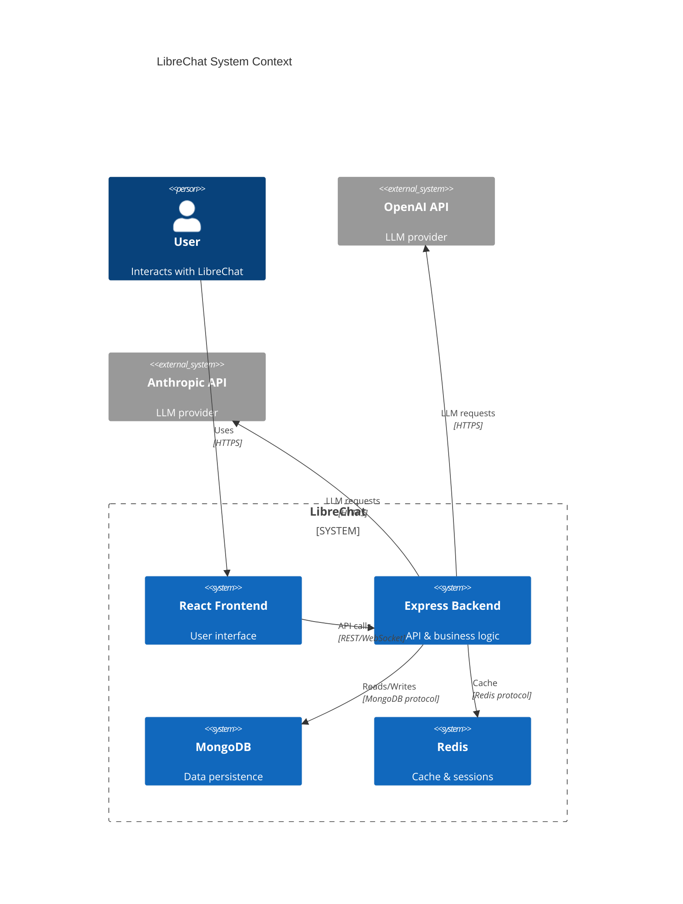
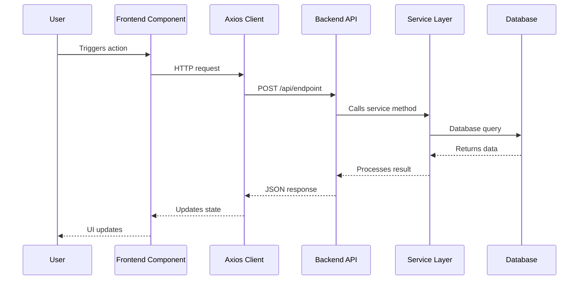
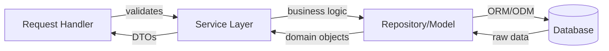
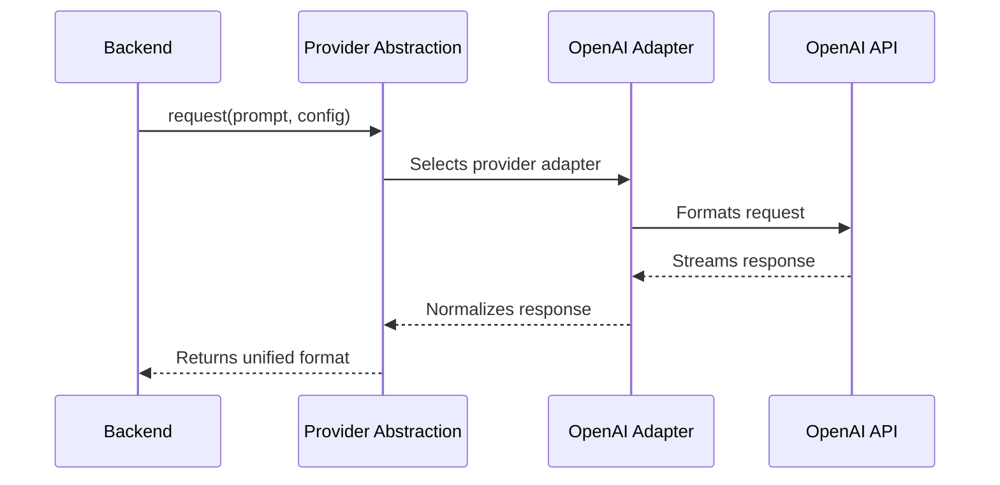
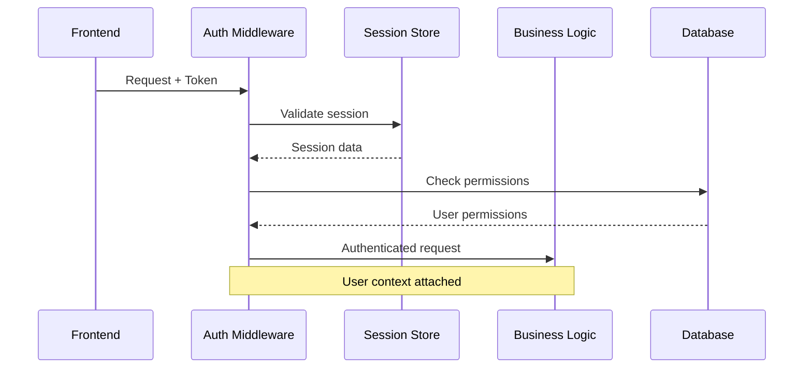

---

Here's a refined prompt that prioritizes your two needs:

# **LibreChat Deep-Dive Prompt: Feature Mapping & System Integration**

```markdown
# Mission: Complete Feature Inventory & Integration Architecture Documentation

You are tasked with creating comprehensive documentation for LibreChat that answers two critical questions for an experienced backend developer:

1. **What can LibreChat do?** (Complete feature inventory)
2. **How does it all work together?** (System integration & data flow)

## Developer Context

**Profile**: 
- Senior Node.js/TypeScript backend developer
- Strong NestJS, WebSocket, and real-time systems experience  
- Learns best through: understanding connections, tracing data flow, seeing the big picture
- **Learning goal**: Build a complete mental model of LibreChat's architecture

**Current gaps**:
- Don't know all features LibreChat offers
- Don't understand how backend, frontend, database, and external services integrate
- Need to see the complete picture before diving into details

---

## Part 1: Complete Feature Map

### Objective
Create an exhaustive, categorized inventory of every feature in LibreChat, mapped to its implementation.

### Required Structure: `@docs/00-overview/feature-map.md`

```markdown
# LibreChat Complete Feature Map

## Feature Categories

### 1. Chat & Conversation Features
| Feature | User-Facing Capability | Implementation Entry Point | Key Files | Status |
|---------|------------------------|---------------------------|-----------|--------|
| Multi-model chat | User can chat with different LLMs | `api/server/routes/ask/[provider].js` | [list] | ✅ Core |
| Conversation branching | User can fork conversations | [entry point] | [files] | [status] |
| Message editing | User can edit sent messages | [entry point] | [files] | [status] |
| [Continue for ALL chat features...] |

#### Feature Deep-Dive: Multi-model Chat
**What it does**: [User perspective]
**How it works**: [Technical flow]
**Integration points**: [What it connects to]
**Configuration**: [How to enable/customize]
**Source trail**: 
1. User action → `[frontend component]`
2. API call → `[backend endpoint]`
3. Processing → `[service layer]`
4. LLM integration → `[provider abstraction]`
5. Response streaming → `[WebSocket handler]`

### 2. Authentication & User Management
[Same detailed table format]

### 3. Model Provider Integrations  
| Provider | Supported Models | Integration Type | Config Location | Rate Limiting |
|----------|------------------|------------------|-----------------|---------------|
| OpenAI | GPT-4, GPT-3.5 | [REST/SDK] | [config file] | [implementation] |
| [Continue for ALL providers...] |

### 4. File & Document Handling
[Same format...]

### 5. Plugin System
[Same format...]

### 6. Real-time Features
[Same format...]

### 7. Admin & Configuration
[Same format...]

### 8. Data Management
[Same format...]

## Feature Relationship Map

```mermaid
graph TB
    subgraph User Features
        Chat[Chat Interface]
        Files[File Upload]
        Plugins[Plugin System]
    end
    
    subgraph Core Systems
        Auth[Authentication]
        API[API Layer]
        DB[(Database)]
    end
    
    Chat --> API
    Files --> API
    Plugins --> API
    API --> Auth
    API --> DB
    
    [Continue mapping ALL features and their connections]
```

## Feature Priority Matrix

| Priority | Features | Why It Matters | Dependencies |
|----------|----------|----------------|--------------|
| **Critical Path** | [Features required for basic functionality] | [Impact] | [What must work first] |
| **Core Features** | [Primary user-facing features] | [Impact] | [Dependencies] |
| **Enhanced Features** | [Nice-to-have functionality] | [Impact] | [Dependencies] |
| **Optional Features** | [Optional/experimental] | [Impact] | [Dependencies] |

## Implementation Complexity Map

| Feature | Frontend Complexity | Backend Complexity | Integration Complexity | Learning Priority |
|---------|--------------------|--------------------|------------------------|-------------------|
| [Feature] | [Low/Med/High] | [Low/Med/High] | [Low/Med/High] | [1-10] |

[This helps you know what to study first]
```

---

## Part 2: System Integration Architecture

### Objective
Document how every system connects, communicates, and shares data.

### Required Structure: `@docs/00-overview/system-integration.md`

```markdown
# LibreChat System Integration Architecture

## The Big Picture: How Everything Connects

### System Component Overview



## Integration Layers

### Layer 1: Frontend ↔ Backend Integration

#### Communication Patterns

**Pattern A: REST API Calls**


**Source References**:
- Frontend initiation: `client/src/[specific-file].tsx:L[X]`
- API client: `client/src/utils/api.ts:L[X]`
- Backend endpoint: `api/server/routes/[route].js:L[X]`
- Service layer: `api/server/services/[Service].js:L[X]`

**Pattern B: WebSocket Real-time**
[Same detailed documentation]

**Pattern C: Server-Sent Events**
[Same detailed documentation]

#### State Synchronization
**How frontend state stays in sync with backend state**:
1. [Mechanism 1]: [Explanation + source]
2. [Mechanism 2]: [Explanation + source]
3. [Error handling]: [How conflicts are resolved]

### Layer 2: Backend ↔ Database Integration

#### Data Flow Patterns

**Pattern: Request → Service → Repository → Database**



**Source Trail**:
- Controller: `[file]:L[X]` - Receives HTTP request
- Service: `[file]:L[X]` - Applies business logic  
- Model: `[file]:L[X]` - Defines schema
- Query: `[file]:L[X]` - Actual database interaction

**Transaction Patterns**:
- Where transactions are used: [list with sources]
- How atomicity is ensured: [explanation + source]
- Rollback strategies: [explanation + source]

### Layer 3: Backend ↔ External Services

#### LLM Provider Integration Pattern



**Abstraction Layer Analysis**:
- **Interface location**: `[file]:L[X]`
- **Why this abstraction exists**: [architectural reasoning]
- **How to add new provider**: [step-by-step with sources]

**Provider-Specific Implementations**:

| Provider | Adapter File | Request Format | Response Handling | Error Patterns |
|----------|--------------|----------------|-------------------|----------------|
| OpenAI | [file]:L[X] | [structure] | [implementation] | [how errors handled] |
| Anthropic | [file]:L[X] | [structure] | [implementation] | [how errors handled] |
[Continue for all providers] |

### Layer 4: Cross-Cutting Concerns

#### Authentication Flow Through All Layers



**Implementation References**:
- Frontend token storage: `[file]:L[X]`
- Auth middleware: `[file]:L[X]`
- Session management: `[file]:L[X]`
- Permission checks: `[file]:L[X]`

#### Error Propagation Across System

**How errors flow through the stack**:

```markdown
Frontend Error → API Error → Service Error → Database Error

Error at each layer:
1. **Database throws**: [Exception type] at `[file]:L[X]`
2. **Service catches**: Transforms to `[ServiceError]` at `[file]:L[X]`
3. **API handles**: Returns HTTP [status] at `[file]:L[X]`
4. **Frontend receives**: Displays UI message at `[file]:L[X]`
```

#### Logging & Monitoring Integration

**Where logs are generated**:
- Request logging: `[file]:L[X]`
- Error logging: `[file]:L[X]`
- Performance logging: `[file]:L[X]`

**How monitoring systems plug in**:
[Explanation with source references]

## Data Flow Case Studies

### Case Study 1: Complete Chat Message Flow

**Scenario**: User sends a message requesting GPT-4 to analyze a PDF

**Step-by-step with source references**:

```markdown
1️⃣ **User Action** (Frontend)
   - Component: `client/src/components/Chat/Input.tsx:L[X]`
   - Action: Form submit handler called
   - State updated: Message added to conversation state

2️⃣ **File Upload** (if applicable)
   - Component: `client/src/[file]:L[X]`  
   - Upload handler: Sends file to `POST /api/files/upload`
   - Backend receives: `api/server/routes/files.js:L[X]`
   - File processed: `api/server/services/FileService.js:L[X]`
   - Stored in: [S3/local filesystem] at `[location]`

3️⃣ **API Request** (Frontend → Backend)
   - HTTP client: `client/src/data-provider/[file].ts:L[X]`
   - Request format: `POST /api/ask/openai`
   - Payload structure: [show actual structure]

4️⃣ **Request Received** (Backend)
   - Route handler: `api/server/routes/ask/openai.js:L[X]`
   - Middleware chain:
     * Auth check: `[middleware]:L[X]`
     * Rate limit: `[middleware]:L[X]`
     * Validation: `[middleware]:L[X]`

5️⃣ **Business Logic** (Backend Service Layer)
   - Service called: `api/server/services/[Service].js:L[X]`
   - Operations performed:
     * Retrieve conversation: `[method]:L[X]`
     * Load file context: `[method]:L[X]`
     * Build prompt: `[method]:L[X]`
     * Check user permissions: `[method]:L[X]`

6️⃣ **Database Operations**
   - Save message: `[model]:L[X]` → MongoDB `messages` collection
   - Update conversation: `[model]:L[X]` → MongoDB `conversations` collection
   - Transaction handling: `[file]:L[X]`

7️⃣ **LLM Provider Call** (Backend → OpenAI)
   - Adapter: `api/server/services/Endpoints/openai/[file].js:L[X]`
   - Request formatting: [show transformation]
   - Streaming setup: `[file]:L[X]`

8️⃣ **Response Streaming** (OpenAI → Backend → Frontend)
   - Backend receives chunks: `[file]:L[X]`
   - WebSocket emission: `[file]:L[X]`
   - Frontend receives: `client/src/[file].tsx:L[X]`
   - UI updates: `[component]:L[X]`

9️⃣ **Response Completion**
   - Final message saved: `[file]:L[X]`
   - Token counting: `[file]:L[X]`
   - Cost calculation: `[file]:L[X]`
   - State cleanup: `[file]:L[X]`
```

**Data Transformations**:
- User input → API payload: [show transformation]
- API payload → LLM request: [show transformation]
- LLM response → Database format: [show transformation]
- Database format → Frontend display: [show transformation]

### Case Study 2: [Another critical flow]
[Same detailed breakdown]

### Case Study 3: [Another critical flow]
[Same detailed breakdown]

## System Dependency Map

### Runtime Dependencies

```markdown
graph TD
    Frontend[React App]
    Backend[Express Server]
    Database[(MongoDB)]
    Cache[(Redis)]
    FileStore[File Storage]
    LLM1[OpenAI]
    LLM2[Anthropic]
    
    Frontend -->|HTTP/WS| Backend
    Backend -->|Mongoose| Database
    Backend -->|Redis Client| Cache
    Backend -->|SDK| LLM1
    Backend -->|SDK| LLM2
    Backend -->|S3 SDK| FileStore
    
    Backend -.->|Optional| Queue[Job Queue]
    Queue -.->|Worker| Backend
```

**Startup Dependencies**:
1. [What must be available before server starts]
2. [Graceful degradation strategies]
3. [Health check implementations]

### Code-Level Dependencies

**Module Import Graph** (for critical systems):
```markdown
Key files and what they import:

server.js imports:
  ├── config/[file].js (configuration)
  ├── routes/[file].js (routing)  
  ├── middleware/[file].js (request processing)
  └── services/[file].js (business logic)
  
services/ChatService.js imports:
  ├── models/Message.js (data access)
  ├── utils/[file].js (utilities)
  └── adapters/[provider].js (LLM integration)

[Continue mapping for all critical modules]
```

## Integration Testing Perspective

**How to verify integrations work**:

### Frontend-Backend Integration Tests
- Test location: `[test-file]`
- What's covered: [scenarios]
- How to run: `[command]`

### Backend-Database Integration Tests  
[Same format]

### Backend-External Services Integration Tests
[Same format]

## Configuration & Environment Integration

**How configuration flows through the system**:

```markdown
Environment Variables → Config Loading → Runtime Configuration

1. `.env` file: [location and structure]
2. Config parser: `[file]:L[X]`  
3. Config validation: `[file]:L[X]`
4. Access pattern: How code reads config
5. Override mechanism: How config can be overridden

**Example**: OpenAI API Key Journey
- Defined in: `.env:L[X]` as `OPENAI_API_KEY=xxx`
- Loaded by: `[config-loader]:L[X]`
- Validated by: `[validator]:L[X]`
- Accessed in: `[adapter]:L[X]` as `config.openai.apiKey`
- Used when: [specific scenario]
```

## Performance & Scalability Integration Points

**Where bottlenecks can occur**:

| Integration Point | Potential Issue | Mitigation Strategy | Implementation |
|-------------------|-----------------|---------------------|----------------|
| Frontend → Backend | Too many requests | Request batching | `[file]:L[X]` |
| Backend → Database | Slow queries | Indexing, caching | `[file]:L[X]` |
| Backend → LLM | Rate limiting | Queue system | `[file]:L[X]` |

## Security Integration

**How security is enforced across layers**:

1. **Input validation**: Where and how at each layer
2. **Authentication**: How identity flows through system
3. **Authorization**: Permission checks at each boundary
4. **Data encryption**: In transit and at rest
5. **Secret management**: How API keys are stored/accessed

## Extension Points

**How to add new integrations**:

### Adding a New LLM Provider
1. Create adapter: `api/server/services/Endpoints/[provider]/`
2. Implement interface: `[interface-file]:L[X]`
3. Register provider: `[registry]:L[X]`
4. Add configuration: `[config]:L[X]`
5. Update frontend: `[ui-file]:L[X]`

### Adding a New Feature That Touches Multiple Systems
[Step-by-step guide with file references]
```

---

## Part 3: Integration Roadmap

### Learning Path: From Features to Integration Understanding

```markdown
# Phase 1: Feature Discovery (Day 1, ~4 hours)
**Goal**: Know what LibreChat can do

- [ ] **Step 1.1**: Create complete feature inventory (2 hours)
      Output: `@docs/00-overview/feature-map.md`
      
- [ ] **Step 1.2**: Categorize features by user-facing vs internal (1 hour)
      Output: Feature category diagrams
      
- [ ] **Step 1.3**: Map features to file locations (1 hour)
      Output: Feature → code location mapping

**Checkpoint**: Can you list all major features from memory?

# Phase 2: System Architecture (Day 2, ~6 hours)
**Goal**: Understand the high-level structure

- [ ] **Step 2.1**: Map system components (2 hours)
      Files: Entry points, server setup, main routers
      Output: `@docs/00-overview/architecture.md`
      
- [ ] **Step 2.2**: Identify integration boundaries (2 hours)
      Focus: Where do systems communicate?
      Output: Integration point catalog
      
- [ ] **Step 2.3**: Document communication patterns (2 hours)
      Output: Pattern documentation with examples

**Checkpoint**: Draw the system architecture from memory

# Phase 3: Integration Deep-Dive (Days 3-5, ~20 hours)
**Goal**: Understand how everything connects

- [ ] **Step 3.1**: Frontend-Backend integration (6 hours)
      Trace: API calls, WebSockets, state sync
      Output: `@docs/01-integration/frontend-backend.md`
      
- [ ] **Step 3.2**: Backend-Database integration (4 hours)
      Trace: Data models, queries, transactions
      Output: `@docs/01-integration/backend-database.md`
      
- [ ] **Step 3.3**: Backend-External Services (6 hours)
      Trace: LLM providers, file storage, auth services
      Output: `@docs/01-integration/backend-external.md`
      
- [ ] **Step 3.4**: Cross-cutting concerns (4 hours)
      Trace: Auth, logging, errors, config
      Output: `@docs/01-integration/cross-cutting.md`

**Checkpoint**: Trace a complete user action through all layers

# Phase 4: Feature-by-Feature Analysis (Days 6-15, ~60 hours)
**Goal**: Deep understanding of each feature's implementation

For each major feature:
- [ ] Understand user flow
- [ ] Map technical implementation  
- [ ] Identify all touchpoints
- [ ] Document integration patterns

[Detailed breakdown per feature]

# Phase 5: Mastery (Days 16-20, ~30 hours)
**Goal**: Can extend/modify any part confidently

- [ ] Extension patterns
- [ ] Common modification scenarios
- [ ] Best practices
- [ ] Testing strategies
```

---

## Deliverables Summary

### Critical Documents

1. **`@docs/00-overview/feature-map.md`** - Every feature, categorized and mapped
2. **`@docs/00-overview/system-integration.md`** - How everything connects
3. **`@docs/01-integration/[layer].md`** - Deep-dive on each integration layer
4. **`@docs/02-case-studies/[flow].md`** - Complete traces of critical flows
5. **`@docs/99-reference/dependency-graph.md`** - Visual dependency maps

### Success Criteria

You have complete understanding when you can:

- [ ] List all features without looking at code
- [ ] Draw the complete system architecture
- [ ] Trace any user action through all layers
- [ ] Explain why technical decisions were made
- [ ] Identify where to make any type of modification
- [ ] Add a new feature following existing patterns
- [ ] Understand how a code change affects other systems

---

## Instructions for Analysis

1. **Start with feature discovery**: Build the feature map first
2. **Map high-level architecture**: Understand the big picture
3. **Trace critical flows**: Pick 3-5 most important user actions and trace them completely
4. **Fill in the details**: Document each integration layer systematically
5. **Create visual aids**: Heavy use of Mermaid diagrams for visualization
6. **Always reference source**: Every claim backed by file:line reference

Begin by analyzing the repository and creating the feature map, then proceed to system integration documentation.
```

---
